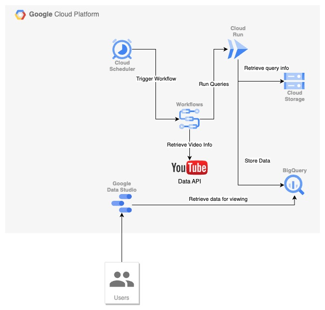

# Asset Coverage Dashboard

The Asset Coverage Dashboard is designed for agencies to get details about the image and videos assets associated with their clients' Demand Gen and Video campaigns.

## Overview

The solution contains two main portions and can be extended or modified however the end users see fit to fulfill their needs. The first portion is a GCP Cloud Workflow which leverages Google APIs and Services to retrieve, combine, and store the campaign asset information in BigQuery. The second is a Looker Dashboard which serves to display the information in a single pane of glass view and provide a shortcut for a user to investigate the campaign further.

## Getting Started

To deploy your own instance of this solution, there are a few pre-requisites you'll want to have setup/available prior in order to ensure success:

- Join the following Google Group to gain access to the dashboard template: [Agency Asset Dashboard Users
](https://groups.google.com/g/agency-asset-dashboard-users)
- [Google Cloud Project](https://developers.google.com/workspace/guides/create-project)
- [Google Ads Developer Token](https://developers.google.com/google-ads/api/docs/get-started/dev-token)
- [Oauth2 Configured for the Google Ads API](https://developers.google.com/google-ads/api/docs/oauth/overview) which will provide the following information:
  - A Client ID
  - A Client secret
  - A valid Refresh Token
- A Google Ads MCC Account ID

Once you have these accounted for you can clone this repository and navigate to the `/terraform/` directory. It is recommended to do this from your [Google Cloud Shell](https://cloud.google.com/shell/docs/launching-cloud-shell) to ensure you have the appropriate tooling, but if you have `gcloud` and `terraform` setup on your machine you should be able to complete the following steps.

>If you'd like, you can create a [tfvars](https://developer.hashicorp.com/terraform/language/values/variables#variable-definitions-tfvars-files) file to specify any values or value overrides for the solution. Any that are not specified you'll be prompted to enter each time you run a `terraform` command (e.g. `plan` or `apply`). For convenience, these definitions will create a `generated.auto.tfvars` file in the `terraform` directory containing the values for any variables that don't have a default associated, meaning unless you'd like to change them in the future, you'll only need to enter them once. These values will also be stored in a `backup.auto.tfvars` object in Cloud Storage should you need to retrieve them again at a later date.

Once in the `terraform` directory, run the following commands:

```bash
# authenticate to docker registry
gcloud auth configure-docker us-central1-docker.pkg.dev

# initialize terraform and required modules
terraform init

# enable APIs for programmatic usage and for provisioning resources via Terraform
terraform apply -target="null_resource.base_apis" -auto-approve
terraform apply -target="google_project_service.required_apis" -auto-approve

# deploy solution
terraform apply -auto-approve
```

The final command will output a URL which can be used to create a copy of the template dashboard.


## Architecture

The architecture of the Asset Coverage Dashboard is largely defined by a Cloud Workflow that is responsible for orchestrating a few different Cloud Run Jobs and services in order to download and format campaign asset information. This data is stored in BigQuery and can be viewed via a copy of the Template Looker Studio Dashboard. The following diagram illustrates this:



### Architecture Notes

- **YouTube Data API** The solution uses the YouTube Data API in order to retrieve information about some of the video assets for campaigns. It only needs to do this once per video, however it does utilize your daily YouTube quota. In the event you have a large number of video assets (e.g. more than 10,000) or are already actively using your quota, it may take a few daily runs of the Workflow to populate BigQuery with all the requisite video information.


## Updating

In order to update the solution, clone the latest from the repo (or `git pull` any updates) and then run `terraform apply` again. This should use the existing state stored in GCS.
